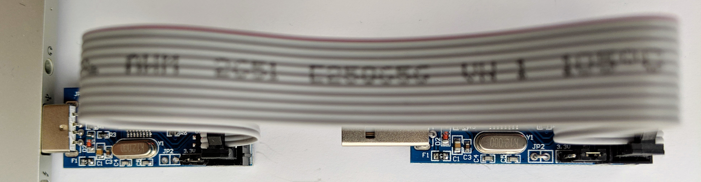

# SMbeeHiveFirmware

The USBASP Provides the main programming functionality of the SMBeeHive programmer. USBASP clones are inexpensive and readily available from [ebay]. As supplied the module only support the ISP programming protocol, it needs to be flash programmed to change the firmware to also support the TPI protocol and control the 12V programming voltage.

A second identical module is required to perform the reprogramming. Once a modules firmware has been changed its ISP capability is still available and can be used to update other USBASP modules.

## Required Utilities

Ensure you have the required utilities installed, you need the same setup as required to flash the bee firmware:
* git
* make
* AVRDUDE

See [SMBee firmware] for install information.

## Get the firmware

To get the files, clone the complete repository into your local file-space:

Change your default directory to a suitable location.

Get a local copy of the repository:
~~~bash
git clone https://github.com/milelo/SMBeeHiveFirmware.git
~~~

## Hardware setup

To prepare for reprogramming set the jumpers on both modules to 5V and connect both modules together using the supplied ribbon cable.

The module being programmed will need to have its two JP2 pins (adjacent to the 3 pin voltage select header pins J1) connected together while it's being programmed. The header pins will likely not be populated but you don't need to solder anything in place, a stiff piece of wire like thin solder wire or some other temporary connection is sufficient, the connection is only required for the few seconds during programming when the programming command is issued.

Connect the module performing the programming to a USB port of the computer, the USB plug of module being programmed should remain unconnected.

A USBASP module (right) prepared for reprogramming. Note its temporary JP2 jumper.

## Issue the programming command

Ensure that the two JP2 pads on the module being reprogrammed are connected and this module isn't connected to a USB port, it is only connect via its ribbon cable.

Invoke `make` to run the AVRDUDE commands:

~~~bash
cd SMBeeHiveFirmware/bin/firmware
make
~~~

## Building the firmware

Ensure you have the required toolchain installed:
* avr-gcc toolchain
* Microsoft [VSCode IDE](https://code.visualstudio.com/download)

See [SMBee firmware] for installation information.

Invoke Build from the **VSCode toolbar**, this will also invoke AVRDUDE to attempt to flash the USBASP:

`Terminal`, `Run Build Task...`

or 

in a terminal window:

~~~bash
cd firmware
make
~~~

## License

The license terms are located in the parent project: [Readme.txt](Readme.txt).

## Background

This custom USBASP firmware based on a [mirror] of https://github.com/stefanbeller/USBASP.

[This is the Readme.txt](Readme.txt) from the mirrored repository.

SMBeeHive PCA and case functionality:

* 12V flash programming. This facilitates the ATtiny10 Reset pin to be used as a general purpose input.
* A dock / jig capability to connect the SMBee to the USBASP.
* A method to power the SMBee from a USB port to support customization of its firmware.

The firmware provides the following customization from the firmware shipped with most devices:
* Support for the TPI programming protocol required by the ATtiny10. This is provided by the mirrored repository.
* Support for 12V flash programming. The firmware control of the reset has been modified from low voltage signalling to powering the 12V DC-DC converter connected to the reset pin for the duration of the programming.

Associated repositories:
* The main repository and KiCad PCB design: [SMBeeHive PCB].
* The case + jig design: [SMBeeHive Dock].

<!--------------------------------------------------------------------------->

[ebay]: https://www.ebay.co.uk/sch/i.html?_odkw=USBASP&_osacat=0&_from=R40&_trksid=p2045573.m570.l1313.TR1.TRC0.A0.H0.XUSBASP+programmer.TRS0&_nkw=USBASP+programmer&_sacat=0

[SMBeeHive PCB]: https://github.com/milelo/SMBeeHiveKiCad
[SMBeeHive Dock]: https://github.com/milelo/SMBeeHiveF360
[mirror]: https://help.github.com/articles/duplicating-a-repository/
[SMBee firmware]: https://github.com/milelo/SMBeeFirmware
